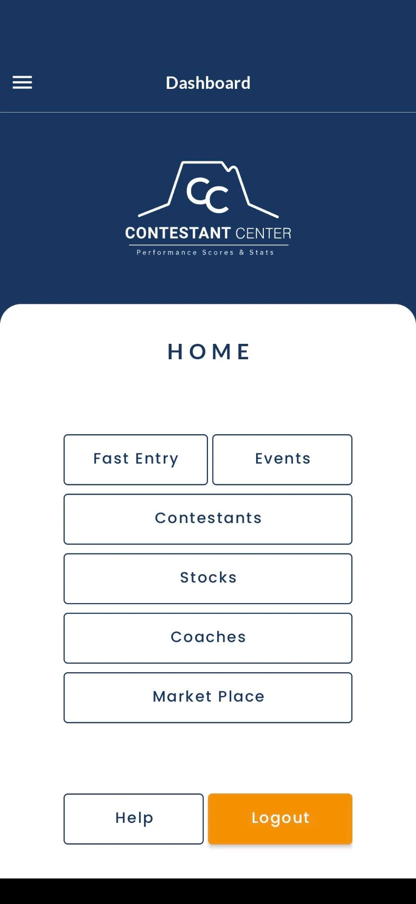

# Senior Android Developer

#### Showcasing my Android Development projects and skills

## About Me
I specialize in building robust Android applications using Java and Kotlin. With a solid understanding of Android SDK and modern architectures like MVVM, I strive to deliver high-quality, user-friendly mobile experiences.

## Projects

### [Contestant Center](https://play.google.com/store/apps/details?id=com.oboIdeas.contestant) | (Xeven Solutions (Pvt) Ltd.)
- **Role:** Android Developer

- **Technologies:** Kotlin, MVVM, Room, Firebase Push Notifications

- **Features:**
  - Organize performance notes and videos for contestants, coaches, and stock contractors.
  - Competition coaching and livestock advertising.
  - Manage rodeo events with ease.

- **Challenges & Solutions:**
  - Implemented efficient video storage and retrieval system using AWS S3 SDK. Enhanced user experience with intuitive UI and smooth navigation.

### Screenshots:

  
  
  

### [IMTrade](https://play.google.com/store/apps/details?id=com.microlinks.IMTrade) | (Softech Systems (Pvt) Ltd.)
- **Role:** Android Developer

- **Technologies:** Java, Android SDK, Firebase

- **Features:**
  - Live Market Watch feature.
  - Investing and trading on companies listed on Pakistan Stock Exchange.
  - Live stock prices monitoring.
  - Portfolio management.

- **Challenges & Solutions:**
  - Ensuring real-time data updates for live stock prices.
  - Implementing secure authentication and transaction handling.

### [UzTrip](https://play.google.com/store/apps/details?id=com.uztrip.application) | (Avicenna Enterprise Solutions)
- **Role:** Android Developer

- **Technologies:** Java, Android SDK, Firebase

- **Features:**
  - Social media platform similar to Facebook.
  - Posting images and videos.
  - Like, share, and comment on posts.
  - Multi-language support: English, Russian, Uzbek.

- **Challenges & Solutions:**
  - Implementing multi-language support without impacting performance.
  - Ensuring seamless media upload and sharing functionality.